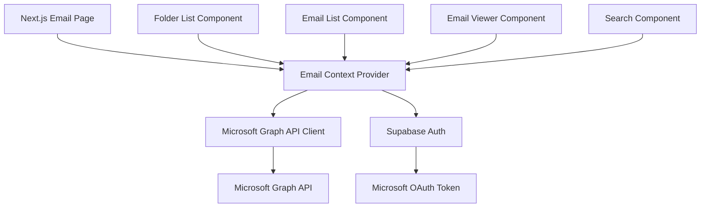
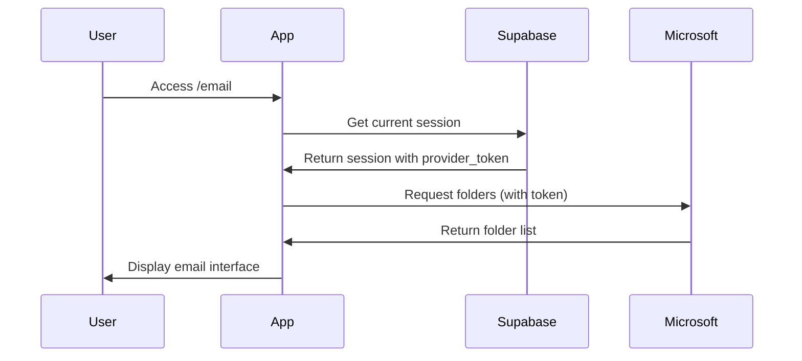

# Design Document - Email Client

## Overview

O Email Client será implementado como uma página Next.js que integra com a Microsoft Graph API para acessar a mailbox do usuário. A solução reutilizará o token de autenticação Microsoft obtido durante o login via Supabase Auth, permitindo acesso direto aos emails sem necessidade de autenticação adicional.

A interface seguirá o padrão de clientes de email modernos, com uma sidebar de pastas à esquerda e a lista de emails à direita, incluindo funcionalidade de busca e visualização de conteúdo completo.

## Architecture

### High-Level Architecture



### Authentication Flow



### Component Hierarchy

```
/email (page)
├── EmailProvider (context)
│   ├── FolderSidebar
│   │   ├── FolderList
│   │   └── FolderItem
│   ├── EmailListPanel
│   │   ├── SearchBar
│   │   ├── EmailList
│   │   └── EmailListItem
│   └── EmailViewer
│       ├── EmailHeader
│       ├── EmailBody
│       └── AttachmentList
```

## Components and Interfaces

### 1. Microsoft Graph API Client

**File:** `lib/microsoft/graph-client.ts`

```typescript
interface GraphClientConfig {
  accessToken: string
}

interface MailFolder {
  id: string
  displayName: string
  unreadItemCount: number
  totalItemCount: number
}

interface EmailMessage {
  id: string
  subject: string
  from: {
    emailAddress: {
      name: string
      address: string
    }
  }
  receivedDateTime: string
  bodyPreview: string
  isRead: boolean
  hasAttachments: boolean
}

interface EmailBody {
  contentType: 'text' | 'html'
  content: string
}

interface Attachment {
  id: string
  name: string
  contentType: string
  size: number
}

class MicrosoftGraphClient {
  getFolders(): Promise<MailFolder[]>
  getMessages(folderId: string, skip?: number, top?: number): Promise<EmailMessage[]>
  getMessage(messageId: string): Promise<EmailMessage & { body: EmailBody, attachments: Attachment[] }>
  searchMessages(query: string): Promise<EmailMessage[]>
  markAsRead(messageId: string): Promise<void>
  downloadAttachment(messageId: string, attachmentId: string): Promise<Blob>
}
```

### 2. Email Context Provider

**File:** `contexts/email-context.tsx`

```typescript
interface EmailContextValue {
  folders: MailFolder[]
  selectedFolder: MailFolder | null
  emails: EmailMessage[]
  selectedEmail: EmailMessage | null
  loading: boolean
  error: string | null
  
  selectFolder: (folderId: string) => void
  selectEmail: (emailId: string) => void
  searchEmails: (query: string) => void
  refreshFolders: () => void
  refreshEmails: () => void
  loadMoreEmails: () => void
}
```

### 3. Folder Sidebar Component

**File:** `components/email/folder-sidebar.tsx`

- Exibe lista de pastas da mailbox
- Mostra contador de não lidos
- Destaca pasta selecionada
- Suporta pastas padrão e customizadas

### 4. Email List Panel Component

**File:** `components/email/email-list-panel.tsx`

- Campo de busca no topo
- Lista de emails com scroll infinito
- Exibe preview de cada email (remetente, assunto, preview, data)
- Distingue visualmente emails lidos/não lidos
- Suporta seleção de email

### 5. Email Viewer Component

**File:** `components/email/email-viewer.tsx`

- Exibe conteúdo completo do email
- Renderiza HTML de forma segura
- Lista anexos com opção de download
- Marca email como lido automaticamente
- Exibe metadados completos (remetente, destinatários, data)

## Data Models

### Microsoft Graph API Endpoints

```
Base URL: https://graph.microsoft.com/v1.0

GET /me/mailFolders
  - Retorna lista de pastas

GET /me/mailFolders/{folderId}/messages
  - Retorna emails de uma pasta
  - Query params: $top, $skip, $select, $orderby

GET /me/messages/{messageId}
  - Retorna email completo com body

GET /me/messages?$search="{query}"
  - Busca emails por conteúdo

PATCH /me/messages/{messageId}
  - Atualiza propriedades (ex: isRead)

GET /me/messages/{messageId}/attachments
  - Lista anexos

GET /me/messages/{messageId}/attachments/{attachmentId}/$value
  - Download de anexo
```

### Token Management

O token Microsoft será obtido através do Supabase Auth:

```typescript
const { data: { session } } = await supabase.auth.getSession()
const microsoftToken = session?.provider_token // Token OAuth da Microsoft
```

## Error Handling

### Error Types

1. **Authentication Errors (401)**
   - Token expirado ou inválido
   - Ação: Tentar refresh do token via Supabase
   - Fallback: Redirecionar para login

2. **Authorization Errors (403)**
   - Permissões insuficientes
   - Ação: Exibir mensagem informando necessidade de permissões

3. **Network Errors**
   - Timeout ou falha de conexão
   - Ação: Exibir mensagem de erro com botão de retry

4. **API Rate Limiting (429)**
   - Muitas requisições
   - Ação: Implementar backoff exponencial

### Error Display Strategy

- Usar toast notifications para erros não críticos
- Exibir estados de erro inline para componentes específicos
- Manter UI funcional mesmo com erros parciais (ex: se pastas carregarem mas emails falharem)

## Testing Strategy

### Unit Tests

1. **Microsoft Graph Client**
   - Mock de respostas da API
   - Teste de parsing de dados
   - Teste de tratamento de erros

2. **Email Context**
   - Teste de state management
   - Teste de ações (selectFolder, selectEmail, etc)
   - Teste de loading states

### Integration Tests

1. **Authentication Flow**
   - Verificar obtenção correta do token
   - Testar refresh de token
   - Testar redirecionamento em caso de falha

2. **Email Operations**
   - Carregar pastas e emails
   - Buscar emails
   - Marcar como lido
   - Download de anexos

### E2E Tests (Optional)

1. Fluxo completo: login → visualizar pastas → abrir email → buscar
2. Teste de responsividade
3. Teste de estados de loading e erro

## Implementation Notes

### Supabase Auth Configuration

Para obter o `provider_token` da Microsoft, é necessário configurar o Supabase Auth:

1. Habilitar Microsoft como provider no Supabase Dashboard
2. Configurar OAuth scopes necessários:
   - `Mail.Read` - Ler emails
   - `Mail.ReadWrite` - Marcar como lido
   - `offline_access` - Refresh token

3. Adicionar variáveis de ambiente:
```env
NEXT_PUBLIC_SUPABASE_URL=...
NEXT_PUBLIC_SUPABASE_ANON_KEY=...
```

### Security Considerations

1. **Token Storage**: Nunca armazenar tokens no localStorage ou cookies inseguros
2. **XSS Prevention**: Sanitizar HTML de emails antes de renderizar
3. **CORS**: Todas as chamadas à Graph API são server-side ou com token seguro
4. **Rate Limiting**: Implementar debounce em buscas e throttling em requisições

### Performance Optimizations

1. **Pagination**: Carregar emails em lotes de 50
2. **Caching**: Usar React Query para cache de pastas e emails
3. **Lazy Loading**: Carregar conteúdo completo apenas quando email é aberto
4. **Debouncing**: Aplicar debounce de 300ms na busca
5. **Virtual Scrolling**: Considerar para listas muito grandes (>1000 emails)

### UI/UX Considerations

1. **Loading States**: Skeleton loaders para melhor percepção de performance
2. **Empty States**: Mensagens amigáveis quando não há emails
3. **Responsive Design**: Layout adaptável para mobile (stack vertical)
4. **Keyboard Navigation**: Suporte para atalhos (j/k para navegar, enter para abrir)
5. **Accessibility**: ARIA labels, navegação por teclado, contraste adequado
