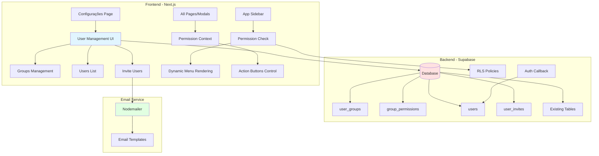
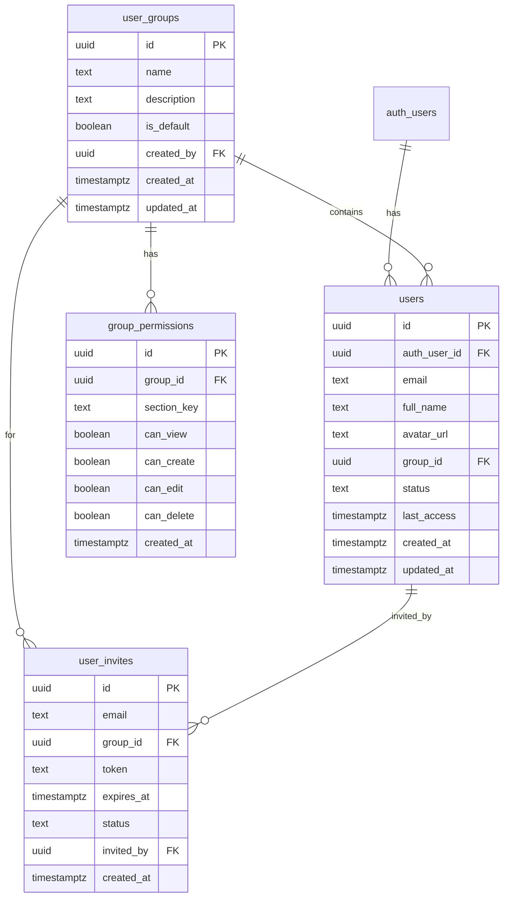

# Design Document - Gestão de Usuários

## Overview

Este documento descreve o design técnico para o sistema de Gestão de Usuários, que implementa controle de acesso baseado em funções (RBAC) com grupos de usuários personalizáveis, permissões granulares por seção, sistema de convites via email, e filtros de conteúdo baseados em atribuição.

O sistema será integrado à página de configurações existente e afetará toda a aplicação, desde a navegação no sidebar até as queries de dados em todas as seções.

### Objetivos Principais

1. Permitir criação e gestão de grupos de usuários com permissões customizáveis
2. Controlar acesso às seções do sistema com 4 níveis de permissão (visualizar, criar, editar, excluir)
3. Implementar sistema de convites com tokens únicos e emails automáticos
4. Sincronizar usuários autenticados via Microsoft com a tabela do Supabase
5. Filtrar conteúdo para que usuários vejam apenas dados atribuídos a eles
6. Aplicar verificações de permissão consistentes em toda a aplicação

### Tecnologias Utilizadas

- **Frontend**: Next.js 14 (App Router), React, TypeScript, Tailwind CSS
- **Backend**: Supabase (PostgreSQL, RLS, Auth)
- **Email**: Nodemailer (via /lib/email/)
- **UI Components**: shadcn/ui
- **State Management**: React Context API


## Architecture

### High-Level Architecture



### Data Flow

1. **User Authentication Flow**
   - User logs in via Microsoft OAuth (existing)
   - Auth callback checks if user exists in `users` table
   - If not exists, creates user record with default group
   - If exists, updates user data and last_access timestamp
   - Loads user permissions into session context

2. **Permission Check Flow**
   - Component requests permission check
   - Permission Context queries user's group permissions
   - Returns boolean for requested action (view, create, edit, delete)
   - Component renders/hides UI elements accordingly

3. **Invite Flow**
   - Admin creates invite with email and group
   - System generates unique token with 7-day expiry
   - Email sent with registration link containing token
   - User clicks link, validates token, completes registration
   - User automatically assigned to specified group

4. **Content Filtering Flow**
   - User requests data (projects, tasks, etc.)
   - Query includes user_id filter
   - RLS policies enforce row-level security
   - Only assigned content returned to user


## Components and Interfaces

### Database Schema

#### New Tables

**1. user_groups**
```sql
CREATE TABLE user_groups (
  id UUID PRIMARY KEY DEFAULT gen_random_uuid(),
  name TEXT NOT NULL UNIQUE,
  description TEXT,
  is_default BOOLEAN DEFAULT false,
  created_by UUID REFERENCES profiles(id) ON DELETE SET NULL,
  created_at TIMESTAMPTZ NOT NULL DEFAULT NOW(),
  updated_at TIMESTAMPTZ NOT NULL DEFAULT NOW()
);
```

**2. group_permissions**
```sql
CREATE TABLE group_permissions (
  id UUID PRIMARY KEY DEFAULT gen_random_uuid(),
  group_id UUID REFERENCES user_groups(id) ON DELETE CASCADE NOT NULL,
  section_key TEXT NOT NULL, -- 'dashboard', 'clientes', 'projetos', etc.
  can_view BOOLEAN DEFAULT false,
  can_create BOOLEAN DEFAULT false,
  can_edit BOOLEAN DEFAULT false,
  can_delete BOOLEAN DEFAULT false,
  created_at TIMESTAMPTZ NOT NULL DEFAULT NOW(),
  UNIQUE(group_id, section_key)
);
```

**3. users** (extends profiles)
```sql
CREATE TABLE users (
  id UUID PRIMARY KEY DEFAULT gen_random_uuid(),
  auth_user_id UUID REFERENCES auth.users(id) ON DELETE CASCADE UNIQUE,
  email TEXT NOT NULL UNIQUE,
  full_name TEXT NOT NULL,
  avatar_url TEXT,
  group_id UUID REFERENCES user_groups(id) ON DELETE SET NULL,
  status TEXT NOT NULL DEFAULT 'active' CHECK (status IN ('active', 'inactive')),
  last_access TIMESTAMPTZ,
  created_at TIMESTAMPTZ NOT NULL DEFAULT NOW(),
  updated_at TIMESTAMPTZ NOT NULL DEFAULT NOW()
);
```

**4. user_invites**
```sql
CREATE TABLE user_invites (
  id UUID PRIMARY KEY DEFAULT gen_random_uuid(),
  email TEXT NOT NULL,
  group_id UUID REFERENCES user_groups(id) ON DELETE CASCADE NOT NULL,
  token TEXT NOT NULL UNIQUE,
  expires_at TIMESTAMPTZ NOT NULL,
  status TEXT NOT NULL DEFAULT 'pending' CHECK (status IN ('pending', 'accepted', 'expired')),
  invited_by UUID REFERENCES users(id) ON DELETE SET NULL,
  created_at TIMESTAMPTZ NOT NULL DEFAULT NOW()
);
```

#### Modified Tables

**projects, tasks, clients, events, files** - Add user assignment tracking:
```sql
-- Add to existing tables
ALTER TABLE projects ADD COLUMN team_members UUID[] DEFAULT '{}';
ALTER TABLE tasks ADD COLUMN watchers UUID[] DEFAULT '{}';
ALTER TABLE clients ADD COLUMN assigned_users UUID[] DEFAULT '{}';
```


### TypeScript Types

```typescript
// lib/types.ts additions

export type UserGroup = {
  id: string
  name: string
  description: string | null
  is_default: boolean
  created_by: string | null
  created_at: string
  updated_at: string
}

export type GroupPermission = {
  id: string
  group_id: string
  section_key: string
  can_view: boolean
  can_create: boolean
  can_edit: boolean
  can_delete: boolean
  created_at: string
}

export type User = {
  id: string
  auth_user_id: string
  email: string
  full_name: string
  avatar_url: string | null
  group_id: string | null
  status: 'active' | 'inactive'
  last_access: string | null
  created_at: string
  updated_at: string
}

export type UserInvite = {
  id: string
  email: string
  group_id: string
  token: string
  expires_at: string
  status: 'pending' | 'accepted' | 'expired'
  invited_by: string | null
  created_at: string
}

export type Permission = {
  view: boolean
  create: boolean
  edit: boolean
  delete: boolean
}

export type UserPermissions = {
  [sectionKey: string]: Permission
}

export type SectionKey = 
  | 'dashboard'
  | 'clientes'
  | 'projetos'
  | 'kanban'
  | 'agenda'
  | 'atendimento'
  | 'arquivos'
  | 'email'
  | 'configuracoes'
```


### Frontend Components

#### 1. User Management Page (`app/(app)/configuracoes/usuarios/page.tsx`)

Main page with tabs for:
- Groups Management
- Users List
- Invite Users

```typescript
interface UserManagementPageProps {}

export default function UserManagementPage() {
  return (
    <Tabs defaultValue="groups">
      <TabsList>
        <TabsTrigger value="groups">Grupos</TabsTrigger>
        <TabsTrigger value="users">Usuários</TabsTrigger>
        <TabsTrigger value="invites">Convites</TabsTrigger>
      </TabsList>
      
      <TabsContent value="groups">
        <GroupsManagement />
      </TabsContent>
      
      <TabsContent value="users">
        <UsersList />
      </TabsContent>
      
      <TabsContent value="invites">
        <InviteUsers />
      </TabsContent>
    </Tabs>
  )
}
```

#### 2. Groups Management Component

```typescript
interface GroupsManagementProps {}

function GroupsManagement() {
  // List of groups with create/edit/delete actions
  // Each group shows:
  // - Name, description
  // - Number of users
  // - Edit button (opens permissions dialog)
  // - Delete button (with confirmation)
}
```

#### 3. Group Permissions Dialog

```typescript
interface GroupPermissionsDialogProps {
  group: UserGroup
  onSave: (permissions: GroupPermission[]) => void
}

function GroupPermissionsDialog({ group, onSave }: GroupPermissionsDialogProps) {
  // Table with sections as rows
  // Columns: Section Name, View, Create, Edit, Delete
  // Each cell is a checkbox
  // Auto-check "View" when other permissions are checked
}
```

#### 4. Users List Component

```typescript
interface UsersListProps {}

function UsersList() {
  // Table showing all users:
  // - Avatar, Name, Email
  // - Group (with dropdown to change)
  // - Status (active/inactive toggle)
  // - Last Access
  // - Actions (edit, deactivate)
}
```

#### 5. Invite Users Component

```typescript
interface InviteUsersProps {}

function InviteUsers() {
  // Form to send invites:
  // - Email input
  // - Group selector
  // - Send button
  // 
  // List of pending invites:
  // - Email, Group, Expires At, Status
  // - Resend/Cancel actions
}
```

#### 6. Permission Context (`contexts/permission-context.tsx`)

```typescript
interface PermissionContextValue {
  permissions: UserPermissions
  hasPermission: (section: SectionKey, action: 'view' | 'create' | 'edit' | 'delete') => boolean
  isLoading: boolean
  currentUser: User | null
}

export function PermissionProvider({ children }: { children: React.ReactNode }) {
  // Load user permissions on mount
  // Provide permission check function
  // Cache permissions in context
}

export function usePermissions() {
  return useContext(PermissionContext)
}
```

#### 7. Protected Component Wrapper

```typescript
interface ProtectedProps {
  section: SectionKey
  action: 'view' | 'create' | 'edit' | 'delete'
  fallback?: React.ReactNode
  children: React.ReactNode
}

export function Protected({ section, action, fallback, children }: ProtectedProps) {
  const { hasPermission } = usePermissions()
  
  if (!hasPermission(section, action)) {
    return fallback || null
  }
  
  return <>{children}</>
}
```


### Backend Services

#### 1. User Sync Service (`lib/services/user-sync.ts`)

```typescript
interface SyncUserParams {
  authUserId: string
  email: string
  fullName: string
  avatarUrl?: string
}

export async function syncUserWithDatabase(params: SyncUserParams): Promise<User> {
  // Check if user exists by auth_user_id
  // If not, create with default group
  // If yes, update data and last_access
  // Return user record
}
```

#### 2. Permission Service (`lib/services/permissions.ts`)

```typescript
export async function getUserPermissions(userId: string): Promise<UserPermissions> {
  // Get user's group_id
  // Query group_permissions for that group
  // Transform to UserPermissions object
  // Return permissions map
}

export async function checkPermission(
  userId: string,
  section: SectionKey,
  action: 'view' | 'create' | 'edit' | 'delete'
): Promise<boolean> {
  // Quick permission check
  // Used in API routes
}
```

#### 3. Invite Service (`lib/services/invites.ts`)

```typescript
export async function createInvite(
  email: string,
  groupId: string,
  invitedBy: string
): Promise<UserInvite> {
  // Generate unique token
  // Set expiry to 7 days from now
  // Create invite record
  // Send email
  // Return invite
}

export async function validateInviteToken(token: string): Promise<UserInvite | null> {
  // Check if token exists
  // Check if not expired
  // Check if status is pending
  // Return invite or null
}

export async function acceptInvite(token: string, userId: string): Promise<void> {
  // Validate token
  // Update user's group_id
  // Mark invite as accepted
}
```

#### 4. Email Templates (`lib/email/templates/user-invite.ts`)

```typescript
export function generateInviteEmail(
  recipientEmail: string,
  groupName: string,
  inviteLink: string
): EmailOptions {
  return {
    to: recipientEmail,
    subject: 'Convite para AvaliaTec',
    html: `
      <h1>Você foi convidado para o AvaliaTec</h1>
      <p>Você foi convidado para fazer parte do grupo <strong>${groupName}</strong>.</p>
      <p>Clique no link abaixo para completar seu cadastro:</p>
      <a href="${inviteLink}">Aceitar Convite</a>
      <p>Este link expira em 7 dias.</p>
    `
  }
}
```


### API Routes

#### 1. Groups API (`app/api/groups/route.ts`)

```typescript
// GET /api/groups - List all groups
// POST /api/groups - Create new group
// PUT /api/groups/[id] - Update group
// DELETE /api/groups/[id] - Delete group
```

#### 2. Permissions API (`app/api/groups/[id]/permissions/route.ts`)

```typescript
// GET /api/groups/[id]/permissions - Get group permissions
// PUT /api/groups/[id]/permissions - Update group permissions
```

#### 3. Users API (`app/api/users/route.ts`)

```typescript
// GET /api/users - List all users
// GET /api/users/me - Get current user with permissions
// PUT /api/users/[id] - Update user (change group, status)
```

#### 4. Invites API (`app/api/invites/route.ts`)

```typescript
// GET /api/invites - List pending invites
// POST /api/invites - Create new invite
// POST /api/invites/validate - Validate invite token
// POST /api/invites/accept - Accept invite
// DELETE /api/invites/[id] - Cancel invite
```


## Data Models

### Section Keys Mapping

```typescript
export const SECTIONS = {
  dashboard: {
    key: 'dashboard',
    label: 'Dashboard',
    path: '/dashboard',
    icon: 'LayoutDashboard'
  },
  clientes: {
    key: 'clientes',
    label: 'Clientes',
    path: '/clientes',
    icon: 'Users'
  },
  projetos: {
    key: 'projetos',
    label: 'Projetos',
    path: '/projetos',
    icon: 'Briefcase'
  },
  kanban: {
    key: 'kanban',
    label: 'Tarefas',
    path: '/kanban',
    icon: 'FolderKanban'
  },
  agenda: {
    key: 'agenda',
    label: 'Agenda',
    path: '/agenda',
    icon: 'Calendar'
  },
  atendimento: {
    key: 'atendimento',
    label: 'Atendimento',
    path: '/atendimento',
    icon: 'WhatsAppIcon'
  },
  arquivos: {
    key: 'arquivos',
    label: 'Arquivos',
    path: '/arquivos',
    icon: 'FileText'
  },
  email: {
    key: 'email',
    label: 'Email',
    path: '/email',
    icon: 'Mail'
  },
  configuracoes: {
    key: 'configuracoes',
    label: 'Configurações',
    path: '/configuracoes',
    icon: 'Settings'
  }
} as const
```

### Default Groups

```typescript
export const DEFAULT_GROUPS = [
  {
    name: 'Administrador',
    description: 'Acesso completo ao sistema',
    is_default: false,
    permissions: {
      dashboard: { view: true, create: true, edit: true, delete: true },
      clientes: { view: true, create: true, edit: true, delete: true },
      projetos: { view: true, create: true, edit: true, delete: true },
      kanban: { view: true, create: true, edit: true, delete: true },
      agenda: { view: true, create: true, edit: true, delete: true },
      atendimento: { view: true, create: true, edit: true, delete: true },
      arquivos: { view: true, create: true, edit: true, delete: true },
      email: { view: true, create: true, edit: true, delete: true },
      configuracoes: { view: true, create: true, edit: true, delete: true }
    }
  },
  {
    name: 'Atendimento',
    description: 'Acesso a atendimento e visualização de projetos',
    is_default: true,
    permissions: {
      dashboard: { view: true, create: false, edit: false, delete: false },
      clientes: { view: true, create: false, edit: false, delete: false },
      projetos: { view: true, create: false, edit: false, delete: false },
      kanban: { view: true, create: false, edit: false, delete: false },
      agenda: { view: true, create: true, edit: true, delete: false },
      atendimento: { view: true, create: true, edit: true, delete: false },
      arquivos: { view: true, create: false, edit: false, delete: false },
      email: { view: true, create: true, edit: false, delete: false },
      configuracoes: { view: false, create: false, edit: false, delete: false }
    }
  }
]
```


## Error Handling

### Error Types

```typescript
export class PermissionError extends Error {
  constructor(message: string) {
    super(message)
    this.name = 'PermissionError'
  }
}

export class InviteError extends Error {
  constructor(message: string) {
    super(message)
    this.name = 'InviteError'
  }
}

export class UserSyncError extends Error {
  constructor(message: string) {
    super(message)
    this.name = 'UserSyncError'
  }
}
```

### Error Scenarios

1. **Permission Denied**
   - User tries to access section without permission
   - Redirect to access denied page or show toast
   - Log attempt for security audit

2. **Invalid Invite Token**
   - Token expired or doesn't exist
   - Show error message with option to request new invite
   - Log invalid token attempts

3. **User Sync Failure**
   - Database connection error
   - Allow user to continue with limited permissions
   - Retry sync on next request
   - Log error for admin review

4. **Email Send Failure**
   - SMTP error or invalid email
   - Show error to admin
   - Save invite as pending for manual retry
   - Log email failure

5. **Group Deletion with Users**
   - Prevent deletion if users assigned
   - Show error with user count
   - Suggest reassigning users first

### Error Responses

```typescript
// API Error Response Format
interface ApiError {
  error: string
  code: string
  details?: any
}

// Example responses
{
  error: 'Permission denied',
  code: 'PERMISSION_DENIED',
  details: { section: 'projetos', action: 'delete' }
}

{
  error: 'Invite token expired',
  code: 'INVITE_EXPIRED',
  details: { expiresAt: '2024-01-15T10:00:00Z' }
}
```


## Testing Strategy

### Unit Tests

1. **Permission Service Tests**
   - Test permission loading for different groups
   - Test permission checks for all actions
   - Test caching behavior
   - Test error handling

2. **Invite Service Tests**
   - Test token generation uniqueness
   - Test expiry calculation
   - Test validation logic
   - Test acceptance flow

3. **User Sync Tests**
   - Test new user creation
   - Test existing user update
   - Test default group assignment
   - Test error scenarios

### Integration Tests

1. **Auth Flow Tests**
   - Test Microsoft login → user sync → permission load
   - Test new user gets default group
   - Test existing user data updates

2. **Invite Flow Tests**
   - Test invite creation → email send → token validation → acceptance
   - Test expired token handling
   - Test duplicate email handling

3. **Permission Flow Tests**
   - Test sidebar rendering based on permissions
   - Test action button visibility
   - Test API route protection
   - Test content filtering

### E2E Tests

1. **Admin Workflow**
   - Create group with custom permissions
   - Invite user to group
   - Verify user receives email
   - Verify user can access only permitted sections

2. **User Workflow**
   - Login as user with limited permissions
   - Verify sidebar shows only permitted sections
   - Verify cannot access restricted sections
   - Verify sees only assigned content

3. **Group Management**
   - Create/edit/delete groups
   - Modify permissions
   - Move users between groups
   - Verify permission changes apply immediately

### Test Data

```typescript
// Mock users for testing
export const TEST_USERS = {
  admin: {
    email: 'admin@test.com',
    group: 'Administrador'
  },
  atendimento: {
    email: 'atendimento@test.com',
    group: 'Atendimento'
  },
  viewer: {
    email: 'viewer@test.com',
    group: 'Visualizador'
  }
}

// Mock permissions
export const TEST_PERMISSIONS = {
  full: { view: true, create: true, edit: true, delete: true },
  readOnly: { view: true, create: false, edit: false, delete: false },
  none: { view: false, create: false, edit: false, delete: false }
}
```


## Security Considerations

### Row Level Security (RLS)

All new tables must have RLS enabled with appropriate policies:

```sql
-- user_groups: Only admins can manage
CREATE POLICY "Admins can manage groups"
  ON user_groups FOR ALL
  TO authenticated
  USING (
    EXISTS (
      SELECT 1 FROM users
      WHERE users.auth_user_id = auth.uid()
      AND users.group_id IN (
        SELECT id FROM user_groups WHERE name = 'Administrador'
      )
    )
  );

-- group_permissions: Only admins can manage
CREATE POLICY "Admins can manage permissions"
  ON group_permissions FOR ALL
  TO authenticated
  USING (
    EXISTS (
      SELECT 1 FROM users
      WHERE users.auth_user_id = auth.uid()
      AND users.group_id IN (
        SELECT id FROM user_groups WHERE name = 'Administrador'
      )
    )
  );

-- users: Users can view all, only admins can modify
CREATE POLICY "Users can view all users"
  ON users FOR SELECT
  TO authenticated
  USING (true);

CREATE POLICY "Admins can modify users"
  ON users FOR UPDATE
  TO authenticated
  USING (
    EXISTS (
      SELECT 1 FROM users u
      WHERE u.auth_user_id = auth.uid()
      AND u.group_id IN (
        SELECT id FROM user_groups WHERE name = 'Administrador'
      )
    )
  );

-- user_invites: Only admins can manage
CREATE POLICY "Admins can manage invites"
  ON user_invites FOR ALL
  TO authenticated
  USING (
    EXISTS (
      SELECT 1 FROM users
      WHERE users.auth_user_id = auth.uid()
      AND users.group_id IN (
        SELECT id FROM user_groups WHERE name = 'Administrador'
      )
    )
  );
```

### Content Filtering RLS

Update existing tables to filter by assigned users:

```sql
-- Projects: Users see only projects they're assigned to
CREATE POLICY "Users see assigned projects"
  ON projects FOR SELECT
  TO authenticated
  USING (
    auth.uid() = ANY(team_members)
    OR created_by = auth.uid()
    OR assigned_to = auth.uid()
    OR EXISTS (
      SELECT 1 FROM users
      WHERE users.auth_user_id = auth.uid()
      AND users.group_id IN (
        SELECT id FROM user_groups WHERE name = 'Administrador'
      )
    )
  );

-- Tasks: Users see only tasks assigned to them
CREATE POLICY "Users see assigned tasks"
  ON tasks FOR SELECT
  TO authenticated
  USING (
    assigned_to = auth.uid()
    OR auth.uid() = ANY(watchers)
    OR created_by = auth.uid()
    OR EXISTS (
      SELECT 1 FROM task_members
      WHERE task_members.task_id = tasks.id
      AND task_members.user_id = auth.uid()
    )
    OR EXISTS (
      SELECT 1 FROM users
      WHERE users.auth_user_id = auth.uid()
      AND users.group_id IN (
        SELECT id FROM user_groups WHERE name = 'Administrador'
      )
    )
  );

-- Similar policies for clients, events, files
```

### API Security

1. **Authentication Check**
   - All API routes must verify authenticated user
   - Use Supabase auth.getUser() to validate session

2. **Permission Verification**
   - Check user permissions before executing operations
   - Return 403 Forbidden if permission denied

3. **Input Validation**
   - Validate all input data
   - Sanitize email addresses
   - Validate UUIDs and foreign keys

4. **Rate Limiting**
   - Implement rate limiting on invite endpoints
   - Prevent invite spam

### Token Security

1. **Invite Tokens**
   - Use cryptographically secure random tokens
   - Minimum 32 characters
   - Single use only
   - Expire after 7 days

2. **Token Storage**
   - Hash tokens before storing (optional for extra security)
   - Never expose tokens in logs
   - Delete expired tokens regularly


## Implementation Details

### Sidebar Dynamic Rendering

Update `components/app-sidebar.tsx`:

```typescript
export function AppSidebar() {
  const { permissions, isLoading } = usePermissions()
  
  // Filter menu items based on permissions
  const visibleMenuItems = menuItems.filter(item => {
    const sectionKey = item.href.replace('/', '') as SectionKey
    return permissions[sectionKey]?.view === true
  })
  
  if (isLoading) {
    return <SidebarSkeleton />
  }
  
  return (
    <Sidebar>
      {/* ... */}
      <SidebarContent>
        <SidebarGroup>
          <SidebarGroupContent>
            {visibleMenuItems.map((item) => (
              <SidebarMenuItem key={item.href} /* ... */>
                {/* ... */}
              </SidebarMenuItem>
            ))}
          </SidebarGroupContent>
        </SidebarGroup>
      </SidebarContent>
      {/* ... */}
    </Sidebar>
  )
}
```

### Action Button Protection

Example in project page:

```typescript
export default function ProjectsPage() {
  const { hasPermission } = usePermissions()
  
  return (
    <div>
      <div className="flex justify-between">
        <h1>Projetos</h1>
        
        <Protected section="projetos" action="create">
          <Button onClick={handleCreateProject}>
            Novo Projeto
          </Button>
        </Protected>
      </div>
      
      <ProjectsList
        onEdit={hasPermission('projetos', 'edit') ? handleEdit : undefined}
        onDelete={hasPermission('projetos', 'delete') ? handleDelete : undefined}
      />
    </div>
  )
}
```

### Content Filtering in Queries

Example in projects query:

```typescript
export async function getProjects(userId: string) {
  const supabase = createClient()
  
  // RLS will automatically filter based on team_members
  const { data, error } = await supabase
    .from('projects')
    .select('*')
    .order('created_at', { ascending: false })
  
  if (error) throw error
  return data
}
```

### User Sync in Auth Callback

Update `app/auth/callback/route.ts`:

```typescript
export async function GET(request: Request) {
  // ... existing auth code ...
  
  if (user) {
    // Sync user with database
    await syncUserWithDatabase({
      authUserId: user.id,
      email: user.email!,
      fullName: user.user_metadata.full_name || user.email!,
      avatarUrl: user.user_metadata.avatar_url
    })
  }
  
  // ... rest of callback ...
}
```

### Invite Email Sending

```typescript
export async function sendInviteEmail(
  email: string,
  groupName: string,
  token: string
) {
  const inviteLink = `${process.env.NEXT_PUBLIC_APP_URL}/auth/invite?token=${token}`
  
  const emailOptions = generateInviteEmail(email, groupName, inviteLink)
  
  const result = await sendEmail(emailOptions)
  
  if (!result.success) {
    throw new Error(`Failed to send invite email: ${result.error}`)
  }
  
  return result
}
```

### Invite Acceptance Page

Create `app/auth/invite/page.tsx`:

```typescript
export default async function InvitePage({
  searchParams
}: {
  searchParams: { token: string }
}) {
  const token = searchParams.token
  
  // Validate token
  const invite = await validateInviteToken(token)
  
  if (!invite) {
    return <InvalidInviteMessage />
  }
  
  // Show registration form pre-filled with email
  return <InviteRegistrationForm invite={invite} />
}
```


## Migration Strategy

### Phase 1: Database Setup

1. Create new tables (user_groups, group_permissions, users, user_invites)
2. Create default groups (Administrador, Atendimento)
3. Migrate existing profiles to users table
4. Assign all existing users to Administrador group initially
5. Add team_members/watchers columns to existing tables

### Phase 2: Backend Implementation

1. Implement user sync service
2. Implement permission service
3. Implement invite service
4. Create API routes
5. Update auth callback to sync users
6. Add RLS policies

### Phase 3: Frontend Implementation

1. Create permission context
2. Create user management UI components
3. Update sidebar to use permissions
4. Add Protected component wrapper
5. Update all pages to check permissions
6. Update all modals to check permissions

### Phase 4: Content Filtering

1. Update project queries to filter by team_members
2. Update task queries to filter by assigned users
3. Update client queries to filter by assigned users
4. Update event queries to filter by participants
5. Update file queries to filter by project access
6. Add user assignment UI to all relevant forms

### Phase 5: Testing & Rollout

1. Test with different user groups
2. Test permission changes propagate immediately
3. Test invite flow end-to-end
4. Test content filtering
5. Train administrators on new features
6. Gradual rollout to production

### Data Migration Script

```sql
-- Migrate existing profiles to users table
INSERT INTO users (auth_user_id, email, full_name, avatar_url, group_id, status, created_at)
SELECT 
  p.id,
  au.email,
  p.full_name,
  p.avatar_url,
  (SELECT id FROM user_groups WHERE name = 'Administrador' LIMIT 1),
  'active',
  p.created_at
FROM profiles p
JOIN auth.users au ON au.id = p.id
WHERE NOT EXISTS (
  SELECT 1 FROM users u WHERE u.auth_user_id = p.id
);

-- Assign all existing projects to their creators as team members
UPDATE projects
SET team_members = ARRAY[created_by]
WHERE created_by IS NOT NULL
AND (team_members IS NULL OR team_members = '{}');

-- Similar for other tables...
```


## Performance Considerations

### Caching Strategy

1. **Permission Caching**
   - Cache user permissions in React Context
   - Refresh on group change or login
   - TTL: Session duration
   - Invalidate on permission updates

2. **User List Caching**
   - Cache user list in admin UI
   - Refresh every 5 minutes or on manual refresh
   - Use SWR or React Query for automatic revalidation

3. **Group List Caching**
   - Cache groups and permissions
   - Invalidate on CRUD operations
   - Share cache across components

### Query Optimization

1. **Indexed Columns**
   ```sql
   CREATE INDEX idx_users_auth_user_id ON users(auth_user_id);
   CREATE INDEX idx_users_group_id ON users(group_id);
   CREATE INDEX idx_users_email ON users(email);
   CREATE INDEX idx_group_permissions_group_id ON group_permissions(group_id);
   CREATE INDEX idx_group_permissions_section ON group_permissions(section_key);
   CREATE INDEX idx_user_invites_token ON user_invites(token);
   CREATE INDEX idx_user_invites_email ON user_invites(email);
   ```

2. **Efficient Queries**
   - Use joins instead of multiple queries
   - Select only needed columns
   - Use pagination for large lists
   - Implement cursor-based pagination for infinite scroll

3. **RLS Performance**
   - Keep RLS policies simple
   - Use indexed columns in policies
   - Avoid complex subqueries when possible
   - Test query plans with EXPLAIN ANALYZE

### Frontend Optimization

1. **Lazy Loading**
   - Lazy load user management components
   - Code split by route
   - Load permissions on demand

2. **Memoization**
   - Memoize permission checks
   - Memoize filtered menu items
   - Use React.memo for expensive components

3. **Debouncing**
   - Debounce search inputs
   - Debounce permission updates
   - Batch permission checks

### Monitoring

1. **Performance Metrics**
   - Track permission check latency
   - Monitor RLS query performance
   - Track user sync duration
   - Monitor email send success rate

2. **Error Tracking**
   - Log permission denied attempts
   - Track failed user syncs
   - Monitor invite token validation failures
   - Alert on high error rates


## UI/UX Design

### User Management Page Layout

```
┌─────────────────────────────────────────────────────────┐
│ Configurações > Gestão de Usuários                     │
├─────────────────────────────────────────────────────────┤
│                                                         │
│ [Grupos] [Usuários] [Convites]                         │
│                                                         │
│ ┌─────────────────────────────────────────────────┐   │
│ │ Grupos de Usuários                    [+ Novo]  │   │
│ ├─────────────────────────────────────────────────┤   │
│ │                                                 │   │
│ │ ┌─────────────────────────────────────────┐    │   │
│ │ │ Administrador                    [Edit] │    │   │
│ │ │ Acesso completo ao sistema              │    │   │
│ │ │ 5 usuários                              │    │   │
│ │ └─────────────────────────────────────────┘    │   │
│ │                                                 │   │
│ │ ┌─────────────────────────────────────────┐    │   │
│ │ │ Atendimento                      [Edit] │    │   │
│ │ │ Acesso a atendimento e visualização     │    │   │
│ │ │ 12 usuários                             │    │   │
│ │ └─────────────────────────────────────────┘    │   │
│ │                                                 │   │
│ └─────────────────────────────────────────────────┘   │
│                                                         │
└─────────────────────────────────────────────────────────┘
```

### Group Permissions Dialog

```
┌─────────────────────────────────────────────────────────┐
│ Permissões: Atendimento                        [X]      │
├─────────────────────────────────────────────────────────┤
│                                                         │
│ Seção          │ Visualizar │ Criar │ Editar │ Excluir│
│ ───────────────┼────────────┼───────┼────────┼────────│
│ Dashboard      │     ✓      │       │        │        │
│ Clientes       │     ✓      │       │        │        │
│ Projetos       │     ✓      │       │        │        │
│ Tarefas        │     ✓      │       │        │        │
│ Agenda         │     ✓      │   ✓   │   ✓    │        │
│ Atendimento    │     ✓      │   ✓   │   ✓    │        │
│ Arquivos       │     ✓      │       │        │        │
│ Email          │     ✓      │   ✓   │        │        │
│ Configurações  │            │       │        │        │
│                                                         │
│                              [Cancelar] [Salvar]        │
└─────────────────────────────────────────────────────────┘
```

### Users List

```
┌─────────────────────────────────────────────────────────┐
│ Usuários                                  [+ Convidar]  │
├─────────────────────────────────────────────────────────┤
│                                                         │
│ [Buscar usuários...]                                    │
│                                                         │
│ Avatar │ Nome           │ Email          │ Grupo       │
│ ───────┼────────────────┼────────────────┼─────────────│
│   👤   │ João Silva     │ joao@...       │ Admin ▼     │
│   👤   │ Maria Santos   │ maria@...      │ Atend. ▼    │
│   👤   │ Pedro Costa    │ pedro@...      │ Atend. ▼    │
│                                                         │
│                                          [1] [2] [3]    │
└─────────────────────────────────────────────────────────┘
```

### Invite Form

```
┌─────────────────────────────────────────────────────────┐
│ Convidar Usuário                                        │
├─────────────────────────────────────────────────────────┤
│                                                         │
│ Email                                                   │
│ ┌─────────────────────────────────────────────────┐   │
│ │ usuario@exemplo.com                             │   │
│ └─────────────────────────────────────────────────┘   │
│                                                         │
│ Grupo                                                   │
│ ┌─────────────────────────────────────────────────┐   │
│ │ Atendimento                                  ▼  │   │
│ └─────────────────────────────────────────────────┘   │
│                                                         │
│                              [Cancelar] [Enviar Convite]│
└─────────────────────────────────────────────────────────┘
```

### Visual Feedback

1. **Loading States**
   - Skeleton loaders for user lists
   - Spinner on permission checks
   - Progress indicator on invite send

2. **Success States**
   - Toast notification on successful operations
   - Green checkmark on permission save
   - Confirmation message on invite sent

3. **Error States**
   - Red toast for errors
   - Inline validation errors
   - Clear error messages with actions

4. **Empty States**
   - Friendly message when no users
   - Call-to-action to invite first user
   - Illustration for empty groups


## Future Enhancements

### Phase 2 Features (Post-MVP)

1. **Advanced Permissions**
   - Field-level permissions (e.g., can edit project name but not budget)
   - Time-based permissions (temporary access)
   - IP-based restrictions
   - Device-based restrictions

2. **Audit Log**
   - Track all permission changes
   - Track user access patterns
   - Export audit reports
   - Real-time activity monitoring

3. **Team Collaboration**
   - Team-based permissions (not just individual)
   - Department hierarchies
   - Permission inheritance
   - Delegation of permissions

4. **Advanced Invite Features**
   - Bulk invite via CSV
   - Custom invite messages
   - Invite templates
   - Automatic reminders for pending invites

5. **User Analytics**
   - User activity dashboard
   - Permission usage statistics
   - Login frequency tracking
   - Feature adoption metrics

6. **Self-Service**
   - Users can request access to sections
   - Approval workflow for access requests
   - Temporary access requests
   - Access expiration notifications

7. **Integration**
   - SSO with other providers (Google, Azure AD)
   - LDAP/Active Directory sync
   - SCIM provisioning
   - Webhook notifications for user events

### Scalability Considerations

1. **Large User Base**
   - Implement pagination everywhere
   - Add search and filtering
   - Use virtual scrolling for long lists
   - Optimize permission queries

2. **Many Groups**
   - Group search and filtering
   - Group templates
   - Bulk group operations
   - Group analytics

3. **Complex Permissions**
   - Permission presets
   - Permission comparison tool
   - Permission conflict detection
   - Permission simulation mode


## Appendix

### Database Schema Diagram



### API Endpoints Summary

| Method | Endpoint | Description | Auth Required |
|--------|----------|-------------|---------------|
| GET | /api/groups | List all groups | Yes |
| POST | /api/groups | Create new group | Admin only |
| PUT | /api/groups/[id] | Update group | Admin only |
| DELETE | /api/groups/[id] | Delete group | Admin only |
| GET | /api/groups/[id]/permissions | Get group permissions | Yes |
| PUT | /api/groups/[id]/permissions | Update permissions | Admin only |
| GET | /api/users | List all users | Yes |
| GET | /api/users/me | Get current user | Yes |
| PUT | /api/users/[id] | Update user | Admin only |
| GET | /api/invites | List pending invites | Admin only |
| POST | /api/invites | Create invite | Admin only |
| POST | /api/invites/validate | Validate token | No |
| POST | /api/invites/accept | Accept invite | Yes |
| DELETE | /api/invites/[id] | Cancel invite | Admin only |

### Environment Variables

```bash
# Existing Supabase variables
NEXT_PUBLIC_SUPABASE_URL=your_supabase_url
NEXT_PUBLIC_SUPABASE_ANON_KEY=your_anon_key
SUPABASE_SERVICE_ROLE_KEY=your_service_role_key

# Existing Email variables
SMTP_HOST=smtp.example.com
SMTP_PORT=587
SMTP_SECURE=false
SMTP_USER=your_email@example.com
SMTP_PASSWORD=your_password
SMTP_FROM_NAME=AvaliaTec
SMTP_FROM_EMAIL=noreply@avaliatec.com

# New variables for user management
NEXT_PUBLIC_APP_URL=https://your-app-url.com
DEFAULT_USER_GROUP=Atendimento
INVITE_TOKEN_EXPIRY_DAYS=7
```

### Key Files to Create/Modify

**New Files:**
- `lib/types.ts` (add new types)
- `lib/services/user-sync.ts`
- `lib/services/permissions.ts`
- `lib/services/invites.ts`
- `lib/email/templates/user-invite.ts`
- `contexts/permission-context.tsx`
- `components/protected.tsx`
- `app/(app)/configuracoes/usuarios/page.tsx`
- `app/api/groups/route.ts`
- `app/api/groups/[id]/route.ts`
- `app/api/groups/[id]/permissions/route.ts`
- `app/api/users/route.ts`
- `app/api/users/[id]/route.ts`
- `app/api/users/me/route.ts`
- `app/api/invites/route.ts`
- `app/api/invites/[id]/route.ts`
- `app/api/invites/validate/route.ts`
- `app/api/invites/accept/route.ts`
- `app/auth/invite/page.tsx`
- `supabase/migrations/XXX_user_management.sql`

**Modified Files:**
- `components/app-sidebar.tsx` (add permission filtering)
- `app/auth/callback/route.ts` (add user sync)
- `app/(app)/layout.tsx` (add PermissionProvider)
- All page files (add permission checks)
- All modal components (add permission checks)

---

**Design Document Version:** 1.0  
**Last Updated:** 2025-01-20  
**Status:** Ready for Implementation
